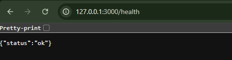

# Week 4 — Axum API Basics

## Objective

Build the first Rust backend API using Axum.

## Endpoint



### GET /health

Response:

```json
{
  "status": "ok"
}
```

## How to Run

```bash
cargo run
```

Server will start at: `http://172.0.0.1:3000`

## How to Test

```bash
curl http://127.0.0.1:3000/health
```

## Status

Completed