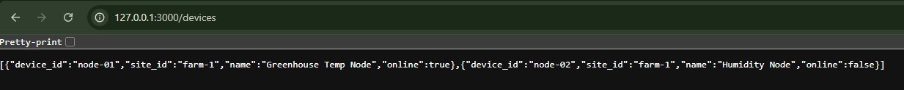

# Week 4 — Axum API Basics

## Objective

Build the Rust backend API using Axum.

## Endpoint



### GET /health

Response:

```json
[{"device_id":"node-01","site_id":"farm-1","name":"Greenhouse Temp Node","online":true},{"device_id":"node-02","site_id":"farm-1","name":"Humidity Node","online":false}]
```

## How to Run

```bash
cargo run
```

Server will start at: `http://172.0.0.1:3000`

## How to Test

```bash
curl http://127.0.0.1:3000/devices
```

## Status

Completed