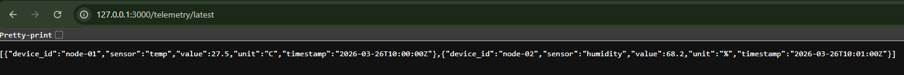

# Week 4 — Axum API Basics

## Objective

Build the Rust backend API using Axum.

## Endpoint



### GET /health

Response:

```json
[{"device_id":"node-01","sensor":"temp","value":27.5,"unit":"C","timestamp":"2026-03-26T10:00:00Z"},{"device_id":"node-02","sensor":"humidity","value":68.2,"unit":"%","timestamp":"2026-03-26T10:01:00Z"}]
```

## How to Run

```bash
cargo run
```

Server will start at: `http://172.0.0.1:3000`

## How to Test

```bash
curl http://127.0.0.1:3000/telemetry/latest
```

## Status

Completed