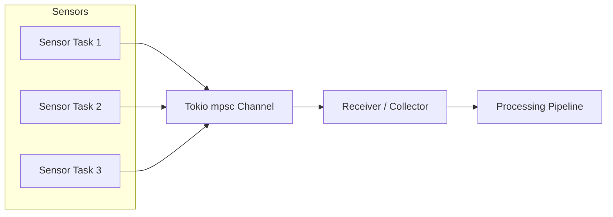

# Week 5 — Task 4  
# Channels for Message Passing (Tokio mpsc)

## Objective

Demonstrate how multiple asynchronous tasks can send messages to a central receiver using a Tokio channel.

This pattern is commonly used in backend systems for:

- event ingestion pipelines
- worker queues
- sensor data aggregation
- telemetry processing

---

## Architecture




Multiple producers send messages into a shared channel while a single consumer receives and processes them.

---

## Key Concepts

### Tokio mpsc channel

`let (tx, rx) = mpsc::channel(32);`

- `tx` : sender (producer)
- `rx` : receiver (consumer)

---

### Producer Tasks

Each simulated sensor sends a message into the channel.

`simulate_sensor(tx.clone(), "node-01", "temp", 27.5)`

---

### Consumer Loop

```rs
while let Some(msg) = rx.recv().await {
    process(msg);
}
```

The receiver waits asynchronously for incoming messages.

---

## Example Output

```bash
INFO Starting channel demo...
INFO node-01 -> temp starting...
INFO node-02 -> humidity starting...
INFO node-03 -> ph starting...
INFO Received => device: node-02, sensor: humidity, value: 68.2
INFO Received => device: node-01, sensor: temp, value: 27.5
INFO Received => device: node-03, sensor: ph, value: 6.8
```

---

## Concepts Learned

- Tokio async tasks
- `tokio::sync::mpsc`
- producer / consumer pattern
- asynchronous message pipelines

---

## Real-World Applications

This pattern is used in:

- IoT telemetry ingestion
- MQTT message pipelines
- background job processing
- streaming data systems

## Status

Completed