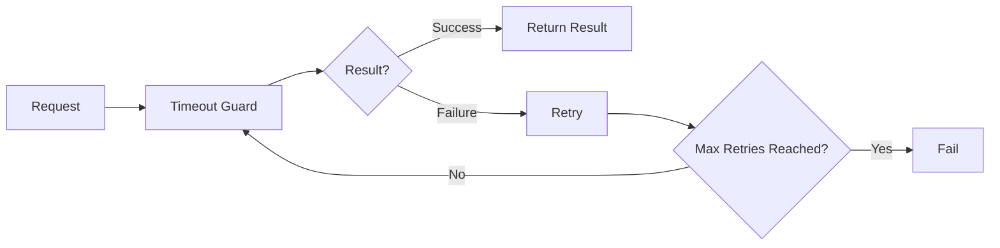

# Week 5 — Task 5  
# Timeout and Retry Patterns in Tokio

## Objective

Implement timeout handling and retry logic for asynchronous operations.

This pattern is critical for:

- network communication
- device communication
- external API calls
- database reconnection logic

---

## Architecture



---

## Timeout

Tokio provides a timeout wrapper for asynchronous operations.


`timeout(Duration::from_secs(3), async_operation).await`


If the operation does not complete within the given time, a timeout error is returned.

---

## Retry Loop

```bash
while attempt <= max_retries {
    attempt += 1
}
```

This allows the system to retry transient failures.

---

## Example Scenario

Simulated sensor read: `read_sensor(device_id, delay)`


If the sensor response is slower than the timeout threshold, the system retries.

---

## Example Output

```bash
INFO node-02 -> attempt 1
WARN node-02 -> timeout on attempt 1
INFO node-02 -> attempt 2
WARN node-02 -> timeout on attempt 2
INFO node-02 -> attempt 3
WARN node-02 -> timeout on attempt 3
ERROR node-02 failed after 3 attempts
```

---

## Concepts Learned

- `tokio::time::timeout`
- retry loops
- transient failure handling
- async resilience patterns

---

## Real-World Applications

Used in:

- MQTT reconnect logic
- HTTP client retry
- database reconnection
- distributed system fault tolerance

## Status

Completed